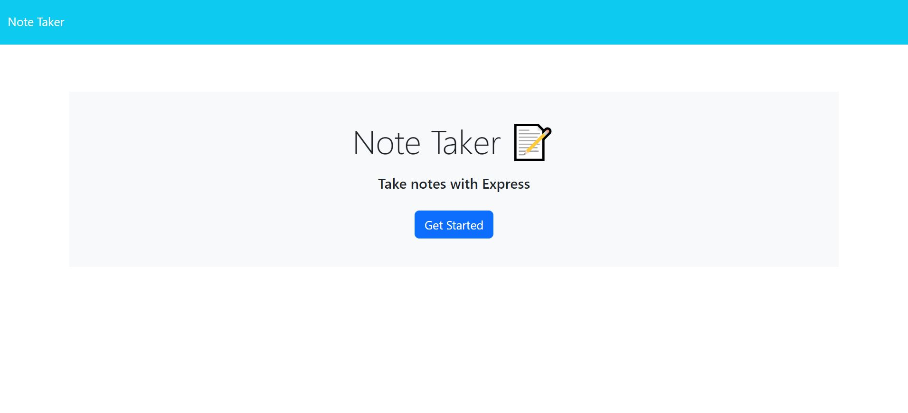

# Note Taker App

  ## Description
  #### An application for writting and saving notes.
  ## Table of Contents
  - [Installation](#installation)
  - [Usage](#usage)
  - [License](#license)
  - [Contributing](#contributing)
  - [Tests](#tests)
  - [Questions](#questions)
  ## Installation
  #### N/A
  ## Usage
  #### Deployed on [Render]()

  #### The idea of completing this project is ...

  
  
  
  ## License
  #### This project is unlicensed.
  ## Contributing
  #### Currently there is no need for contributions.
  ## Tests
  #### Tested at the time of deployment.
  ## Questions
  #### If you have any questions, please open an issue or contact me via email at aalborgil002@gmail.com. You can find more of my work at https://github.com/AndresAlbornozgil.
