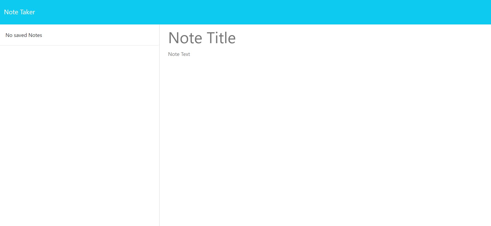

# Note Taker App

  ## Description
  #### An application for writting and saving notes. I built this application for users who feel overwhelmed by their daily tasks and cannot keep track. So with this application any user will be able to write and save notes, so that they can organize their thoughts and keep track of tasks they need to complete. By keeping track of everything, this app helps users avoid missing tasks that they must complete (that simple, yet that important!). By building this application, I learned that software can be challenging to create at first, but once it's running, it certainly makes life easier.
  
  ## Table of Contents
  - [Installation](#installation)
  - [Usage](#usage)
  - [License](#license)
  - [Contributing](#contributing)
  - [Tests](#tests)
  - [Questions](#questions)

  ## Installation
  #### N/A
  
  ## Usage
  #### Deployed on [Render]()
  
  
  
  ## License
  #### This project is unlicensed.
  
  ## Contributing
  #### Currently there is no need for contributions.
  
  ## Tests
  #### Tested at the time of deployment.
  
  ## Questions
  #### If you have any questions, please open an issue or contact me via email at aalborgil002@gmail.com. You can find more of my work at https://github.com/AndresAlbornozgil.
